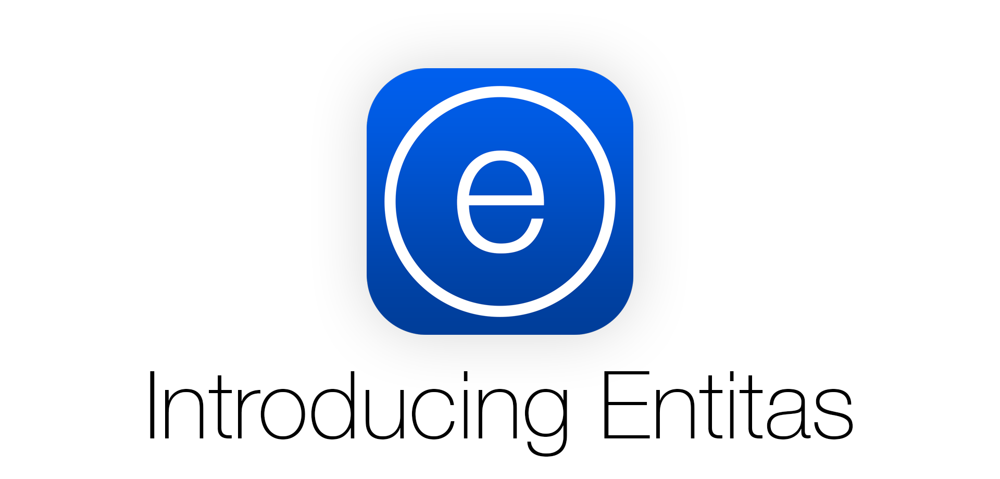
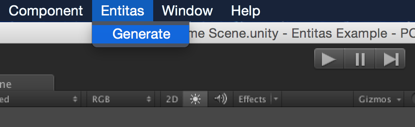
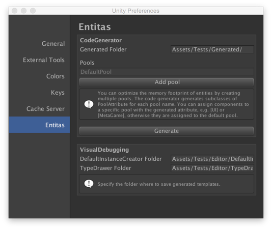
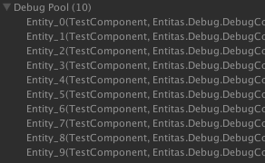
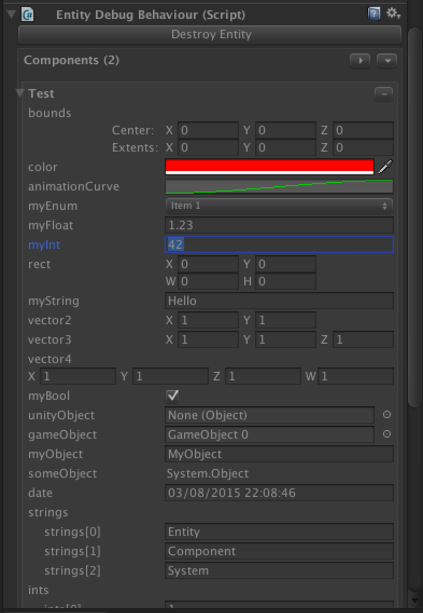
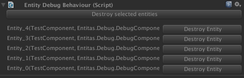
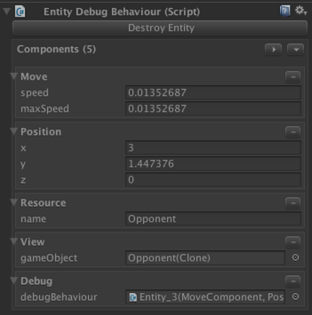
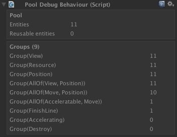

# Entitas - The Entity Component System for C# and Unity
Entitas is a super fast Entity Component System specifically made for C# and Unity. Internal caching and blazing fast component access makes it second to none. Several design decisions were made to work optimal in a garbage collected environment and to go easy on the garbage collector. Entitas comes with an optional code generator which radically reduces the amount of code you have to write and [makes your code read like well written prose.](https://cleancoders.com)

[](https://gitter.im/sschmid/Entitas-CSharp?utm_source=badge&utm_medium=badge&utm_campaign=pr-badge&utm_content=badge)

branch  | tests
:------:|------
master  | [](https://travis-ci.org/sschmid/Entitas-CSharp)
develop | [](https://travis-ci.org/sschmid/Entitas-CSharp)

### [-> Install Entitas](#install-entitas)

## Overview
Entitas consists of the following modules

Module  | Content
:-------|:-------
Entitas | Contains the complete ECS, basically everything you need to get started
Entitas.CodeGenerator | Contains the optional but highly recommended [code generator](#entitascodegenerator)
Entitas.Unity | Contains the plugin based Entitas preferences panel for Unity
Entitas.Unity.CodeGenerator | Plugs into the Entitas preferences panel and adds convenient menu items
Entitas.Unity.VisualDebugging | Integrates Entitas into Unity. Inspect pools, entites and components

## Getting started
Entitas is fast, light and gets rid of unnecessary complexity. There are less than a handful classes you have to know to rocket start your game or application:

- Entity
- Pool
- Group
- Group Observer

After you've read the readme, take a look at the [example project](https://github.com/sschmid/Entitas-CSharp-Example.git) to see Entitas in action. The project illustrates how systems, groups, observers and entities all play together seamlessly.


### Entity
An entity is a container holding data to represent certain objects in your application. You can add, replace or remove data from entities in form of `IComponent`. Entities have corresponding events to let you know if components were added, replaced or removed.

Here's how you can interact with an entity. To enjoy a more natural and more readable API, simply use the code generator that comes with Entitas (see [Code Generator](#entitascodegenerator)). In this example you can see some generated methods for `PositionComponent`, `HealthComponent`, `MovableComponent`.
```cs
entity.AddPosition(0, 0, 0);
entity.AddHealth(100);
entity.isMovable = true;

entity.ReplacePosition(10, 100, -30);
entity.ReplaceHealth(entity.health.health - 1);
entity.isMovable = false;

entity.RemovePosition();

var hasPos = entity.hasPosition;
var movable = entity.isMovable;
```

### Pool
The Pool is the factory where you create and destroy entities. Use it to filter entities of interest.
```cs
// Total components is kindly generated for you by the code generator
var pool = new Pool(ComponentIds.TotalComponents);
var entity = pool.CreateEntity();
entity.isMovable = true;

// Returns all entities having MoveComponent and PositionComponent.
// Matchers are also generated for you.
var entities = pool.GetEntities(Matcher.AllOf(Matcher.Movable, Matcher.Position));
foreach (var e in entities) {
    // do something
}
```

### Group
Groups enable super quick filtering on all the entities in the pool. They are continuously updated when entities change and can return groups of entities instantly. You have thousands of entities and want only those who have a `PositionComponent`? Just ask the pool for this group, it already has the result waiting for you in no time.
```cs
pool.GetGroup(Matcher.Position).GetEntities();
```
Both the group and getting the entities is cached, so even calling this method multiple times is super fast. Always try to use goups when possible. `pool.GetEntities(Matcher.Movable)` internally uses groups, too.

### Group Observer
The Group Observer provides an easy way to react to changes made in a group. Let's say you want to collect and process all the entities where a `PositionComponent` was added or replaced.
```cs
var group = pool.GetGroup(Matcher.Position);
var observer = group.CreateObserver(GroupEventType.OnEntityAdded);

var entities = observer.collectedEntities;
foreach (var e in entities) {
    // do something
}
observer.ClearCollectedEntites();
```
To stop observing, simply deactivate the observer.
```cs
observer.Deactivate();
```

## Processing entities with Systems
Implement `ISystem` to process your entities. I recommend you create systems for each single task or behaviour in your application and execute them in a defined order. This helps to keep your app deterministic. Entitas also provides a special system called `ReactiveSystem`, which is using an Group Observer under the hood. It holds changed entities of interest at your fingertips. Be sure to check out the [example project](https://github.com/sschmid/Entitas-CSharp-Example.git).

# Entitas.CodeGenerator
The Code Generator generates classes and methods for you, so you can focus on getting the job done. It radically reduces the amount of code you have to write and improves readability by a huge magnitude. It makes your code less error-prone while ensuring best performance. I strongly recommend using it!

The Code Generator is smart and produces different output based on the content of the component. The Code Generator differentiates between four types:
- standard component with public fields (e.g. PositionComponent)
- single standard component that is meant to exist only once in the pool (e.g. UserComponent)
- flag component without any fields (e.g. MovableComponent)
- single flag component that is meant to exist only once in the pool (e.g. AnimatingComponent)

### And here is what you get

#### Standard component (e.g. PositionComponent)
```cs
public class PositionComponent : IComponent {
    public int x;
    public int y;
    public int z;
}
```
You get
```cs
var pos = e.position;
var has = e.hasPosition;

e.AddPosition(x, y, z);
e.AddPosition(component);

e.ReplacePosition(x, y, z);

e.RemovePosition();
```

#### Single standard component (e.g. UserComponent)
```cs
[SingleEntity]
public class UserComponent : IComponent {
    public string name;
    public int age;
}
```
You get
```cs
// all from standard component plus methods for the pool

var e = pool.userEntity;
var name = pool.user.name;
var has = pool.hasUser;

pool.SetUser("John", 42);
pool.SetUser(component);

pool.ReplaceUser("Max", 24);

pool.RemoveUser();
```

#### Flag component (e.g. MovableComponent)
```cs
public class MovableComponent : IComponent {}
```
You get
```cs
var movable = e.isMovable;
e.isMovable = true;
e.isMovable = false;
```

#### Single flag component (e.g. AnimatingComponent)
```cs
[SingleEntity]
public class AnimatingComponent : IComponent {}
```
You get
```cs
// all from flag component plus methods for the pool

var e = pool.animatingEntity;
var isAnimating = pool.isAnimating;
pool.isAnimating = true;
pool.isAnimating = false;
```

# Entitas.Unity.CodeGenerator

Entitas.Unity.CodeGenerator extends Unity with a menu item that generates code with a single click.



It also plugs into the Entitas preferences, where you can specify the path to the folder, where the generated files should be saved. In order to have multiple pools, you can specify them here, and the corresponding PoolAttributes will be generated for you.



# Entitas.Unity.VisualDebugging
Visual Debugging enables you to actually see and inspect all of your entities in the Unity Editor. To enable this feature just use `DebugPool` instead of `Pool`. That's it!

```cs
#if (UNITY_EDITOR)
var pool = new DebugPool(ComponentIds.TotalComponents);
DontDestroyOnLoad(pool.entitiesContainer);
#else
var pool = new Pool(ComponentIds.TotalComponents);
#endif
```

Once you use the `DebugPool` all pools and their entities will automatically show up in the hierarchy.



Although entities are no GameObjects and components are no MonoBehaviours you can inspect them as if they were. All components of the selected entity are listed and all their fields are exposed. You can manipulate or remove components at runtime and even destroy the entity. All the default Unity drawers are supported and you can easily create your own `ITypeDrawer` to draw custom objects. [Take a look at these example implementations](https://github.com/sschmid/Entitas-CSharp/tree/develop/Entitas.Unity.VisualDebugging/Assets/Entitas.Unity.VisualDebugging/Editor/TypeDrawer)



When you select multiple entities, you can manually destroy some of them or batch destroy all of them.



Entitas.Unity.VisualDebugging also plugs into the Entitas preferences, where you can specify the folders where you want to save the generated IDefaultInstanceCreator and ITypeDrawer implementations.


Give it a try and checkout the [example project](https://github.com/sschmid/Entitas-CSharp-Example.git)




# Install Entitas
Each release is published with Entitas.zip attached containing all source files you need. It contains
- Entitas
- Entitas.CodeGenerator
- Entitas.Unity
- Entitas.Unity.CodeGenerator
- Entitas.Unity.VisualDebugging

[Show releases](https://github.com/sschmid/Entitas-CSharp/releases)

# Thanks to
Big shout out to [@mzaks](https://github.com/mzaks), [@cloudjubei](https://github.com/cloudjubei) and [@devboy](https://github.com/devboy) for endless hours of discussion and helping making Entitas awesome!

# Maintainers(s)
- [@sschmid](https://github.com/sschmid)

# Different language?
Entitas is also available in
- [Swift](https://github.com/arne-schroppe/Entitas-Swift)
- [Objective-C](https://github.com/wooga/entitas)
- [Clojure](https://github.com/mhaemmerle/entitas-clj)