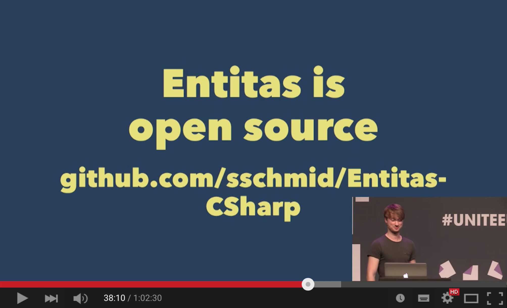
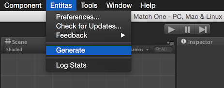
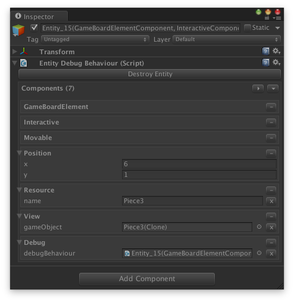
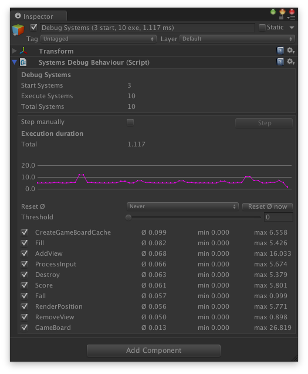

# Entitas - The Entity Component System for C# and Unity
Entitas is a super fast Entity Component System specifically made for C# and Unity. Internal caching and blazing fast component access makes it second to none. Several design decisions were made to work optimal in a garbage collected environment and to go easy on the garbage collector. Entitas comes with an optional code generator which radically reduces the amount of code you have to write and [makes your code read like well written prose.](https://cleancoders.com)

### [> Download Entitas](#download-entitas)
### [> Wiki, Overview and example projects](https://github.com/sschmid/Entitas-CSharp/wiki)

[](https://gitter.im/sschmid/Entitas-CSharp?utm_source=badge&utm_medium=badge&utm_campaign=pr-badge&utm_content=badge)

[](https://twitter.com/intent/follow?original_referer=https%3A%2F%2Fgithub.com%2Fsschmid%2FEntitas-CSharp&screen_name=s_schmid&tw_p=followbutton)

branch  | tests
:------:|------
master  | [](https://travis-ci.org/sschmid/Entitas-CSharp)
develop | [](https://travis-ci.org/sschmid/Entitas-CSharp)

# Watch the talk from UniteEurope 2015
[](http://buff.ly/1KtKlm6)

# First glimpse
The optional [code generator](https://github.com/sschmid/Entitas-CSharp/wiki/Code-Generator) lets you write code that is super fast, save and literally screams its intent.
```cs
public static Entity CreateRedGem(this Pool pool, int x, int y) {
	return pool.CreateEntity()
	           .IsGameBoardElement(true)
	           .IsMovable(true)
	           .AddPosition(x, y)
	           .AddResource(Res.redGem)
	           .IsInteractive(true);
}
```

```cs
var entities = pool.GetEntities(Matcher.AllOf(Matcher.Move, Matcher.Position));
foreach (var entity in entities) {
    var move = entity.move;
    var pos = entity.position;
    entity.ReplacePosition(pos.x, pos.y + move.speed);
}
```


# Overview
Entitas is fast, light and gets rid of unnecessary complexity. There are less than a handful classes you have to know to rocket start your game or application:

- Entity
- Pool
- Group
- Group Observer

[Read more...](https://github.com/sschmid/Entitas-CSharp/wiki/Overview)


# Code Generator
The Code Generator generates classes and methods for you, so you can focus on getting the job done. It radically reduces the amount of code you have to write and improves readability by a huge magnitude. It makes your code less error-prone while ensuring best performance. I strongly recommend using it!

[Read more...](https://github.com/sschmid/Entitas-CSharp/wiki/Code-Generator)


# Unity integration
The optional Unity module integrates Entitas nicely into Unity and provides powerful editor extensions to inspect and debug pools, groups, entities, components and systems.

[Read more...](https://github.com/sschmid/Entitas-CSharp/wiki/Unity)






# Entitas deep dive
[Read the wiki](https://github.com/sschmid/Entitas-CSharp/wiki) or checkout the awesome [example projects](https://github.com/sschmid/Entitas-CSharp/wiki/Examples) to see Entitas in action. These example projects illustrate how systems, groups, observers and entities all play together seamlessly.


# Download Entitas
Each release is published with Entitas.zip attached containing all source files you need. It contains
- Entitas
- Entitas.CodeGenerator
- Entitas.Unity
- Entitas.Unity.CodeGenerator
- Entitas.Unity.VisualDebugging

[Show releases](https://github.com/sschmid/Entitas-CSharp/releases)


# Thanks to
Big shout out to [@mzaks](https://github.com/mzaks), [@cloudjubei](https://github.com/cloudjubei) and [@devboy](https://github.com/devboy) for endless hours of discussion and helping making Entitas awesome!


# Maintainer(s)
- [@sschmid](https://github.com/sschmid) | Twitter: [@s_schmid](https://twitter.com/s_schmid)


# Different language?
Entitas is also available in
- [Swift](https://github.com/mzaks/Entitas)
- [Objective-C](https://github.com/wooga/entitas)
- [Clojure](https://github.com/mhaemmerle/entitas-clj)
- [Haskell](https://github.com/mhaemmerle/entitas-haskell)
- [Erlang](https://github.com/mhaemmerle/entitas_erl)
- [Go](https://github.com/wooga/go-entitas)
