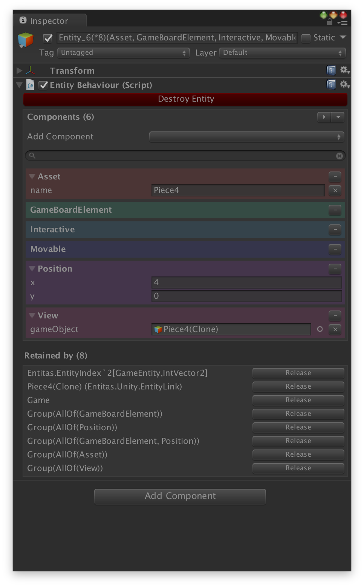
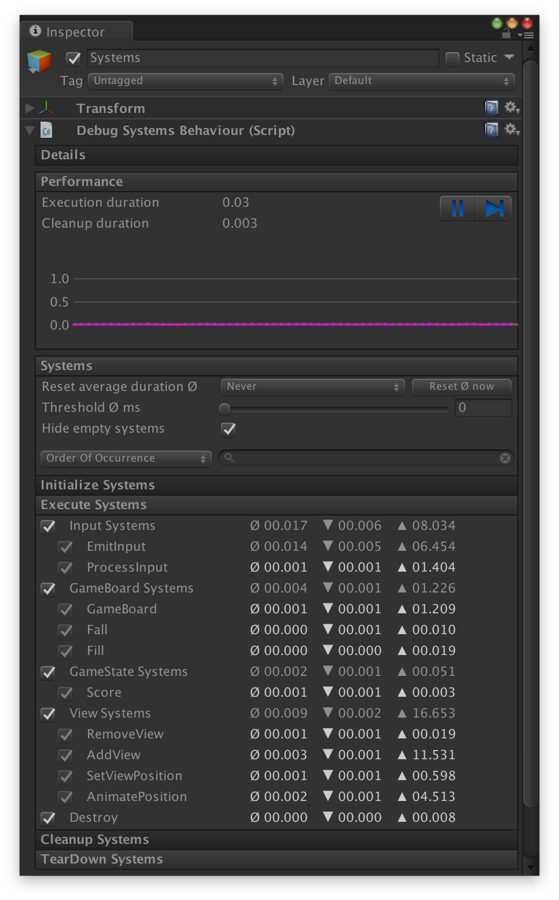

<p align="center">
    
</p>
<p align="center">
    <a href="https://discord.gg/uHrVx5Z"></a>
    <a href="https://github.com/sschmid/Entitas/releases"></a>
    <a href="https://twitter.com/intent/follow?original_referer=https%3A%2F%2Fgithub.com%2Fsschmid%2FEntitas&screen_name=entitas_csharp&tw_p=followbutton"></a>
    <a href="https://twitter.com/intent/follow?original_referer=https%3A%2F%2Fgithub.com%2Fsschmid%2FEntitas&screen_name=s_schmid&tw_p=followbutton"></a>
</p>
<p align="center">
    <b>Entitas is free, but powered by</b>
    <a href="https://www.paypal.com/cgi-bin/webscr?cmd=_s-xclick&hosted_button_id=BTMLSDQULZ852"><b>your donations</b></a>
</p>
<p align="center">
    <a href="https://www.paypal.com/cgi-bin/webscr?cmd=_s-xclick&hosted_button_id=BTMLSDQULZ852"></a>
</p>

# Entitas - The Entity Component System Framework for C# and Unity

Entitas is the most popular open-source Entity Component System Framework (ECS)
and is specifically made for C# and Unity. Several design decisions have been
made to work optimal in a garbage collected environment and to go easy on the
garbage collector. Entitas comes with an optional code generator which radically
reduces the amount of code you have to write and
[makes your code read like well written prose.](https://cleancoders.com)

# Why Entitas

- [#1 open-source ECS on GitHub](https://github.com/sschmid/Entitas)
- 100% open-source under the [MIT License](LICENSE.md)
- great and helpful community on [Discord](https://discord.gg/uHrVx5Z)
- easy to learn and easy to use
- works great in pure C# standalone projects without Unity
- comes with great Unity integration called Visual Debugging
- battle-tested at companies like [Popcore](https://popcore.com) (Rollic / Zynga / Take Two), [Gram Games](https://gram.gs), [Wooga](https://www.wooga.com), [Plarium](https://plarium.com), [Storm Chaser](https://www.stormchaser-games.com) and many more

# Video Tutorials and Unity Unite Talks

| Title                                                     | Video                                                       | Resources                                       |
|-----------------------------------------------------------|-------------------------------------------------------------|-------------------------------------------------|
| Entitas ECS Unity Tutorial - Git & Unit Tests             | [![Video: Shmup2][shmup2-thumb]][shmup2-video]              |                                                 |
| Entitas ECS Unity Tutorial - Setup & Basics               | [![Video: Shmup1][shmup1-thumb]][shmup1-video]              |                                                 |
| Unite Europe 2016: ECS architecture with Unity by example | [![Video: Unite Europe 2016][unite16-thumb]][unite16-video] | [SlideShare: Unite Europe 2016][unite16-slides] |
| Unite Europe 2015: Entity system architecture with Unity  | [![Video: Unite Europe 2015][unite15-thumb]][unite15-video] | [SlideShare: Unite Europe 2015][unite15-slides] |

[shmup2-thumb]: readme/images/Entitas-Shmup-Part-2.jpg "Video: Entitas - Shmup - Part 2"
[shmup2-video]: https://www.youtube.com/watch?v=DZpvUnj2dGI "Video: Entitas - Shmup - Part 2"
[shmup1-thumb]: readme/images/Entitas-Shmup-Part-1.jpg "Video: Entitas - Shmup - Part 1"
[shmup1-video]: https://www.youtube.com/watch?v=L-18XRTarOM "Video: Entitas - Shmup - Part 1"
[unite16-thumb]: readme/images/UniteEurope2016-Video.png "Video: Watch the Entitas Talk at Unite Europe 2016"
[unite16-video]: https://www.youtube.com/watch?v=Phx7IJ3XUzg "Video: Watch the Entitas Talk at Unite Europe 2016"
[unite16-slides]: http://www.slideshare.net/sschmid/uniteeurope-2016 "SlideShare: Unite Europe 2016"
[unite15-thumb]: readme/images/UniteEurope2015-Video.png "Video: Watch the Entitas Talk at Unite Europe 2015"
[unite15-video]: https://www.youtube.com/watch?v=Re5kGtxTW6E "Video: Watch the Entitas Talk at Unite Europe 2015"
[unite15-slides]: http://www.slideshare.net/sschmid/uniteeurope-2015 "SlideShare: Unite Europe 2015"

# First glimpse

The optional [code generator](https://github.com/sschmid/Entitas/wiki/Code-Generator)
lets you write code that is super fast, safe and literally screams its intent.

```csharp
var entity = context.CreateEntity();
entity.AddPosition(Vector3.zero);
entity.AddVelocity(Vector3.forward);
entity.AddAsset("Player");
```

```csharp
using static GameMatcher;

public sealed class MoveSystem : IExecuteSystem
{
    readonly IGroup<GameEntity> _group;

    public MoveSystem(GameContext context)
    {
        _group = context.GetGroup(AllOf(Position, Velocity));
    }

    public void Execute()
    {
        foreach (var e in _group.GetEntities())
            e.ReplacePosition(e.position.value + e.velocity.value);
    }
}
```

# Overview

Entitas is fast, light and gets rid of unnecessary complexity. There are less
than a handful classes you have to know to rocket start your game or application:

- Context
- Entity
- Component
- Group

```
Entitas ECS

+-----------------+
|     Context     |
|-----------------|
|    e       e    |      +-----------+
|       e      e--|----> |  Entity   |
|  e        e     |      |-----------|
|     e  e     e  |      | Component |
| e          e    |      |           |      +-----------+
|    e     e      |      | Component-|----> | Component |
|  e    e    e    |      |           |      |-----------|
|    e    e     e |      | Component |      |   Data    |
+-----------------+      +-----------+      +-----------+
  |
  |
  |     +-------------+  Groups:
  |     |      e      |  Subsets of entities in the context
  |     |   e     e   |  for blazing fast querying
  +---> |        +------------+
        |     e  |    |       |
        |  e     | e  |  e    |
        +--------|----+    e  |
                 |     e      |
                 |  e     e   |
                 +------------+
 ```

[Read more...](https://github.com/sschmid/Entitas/wiki/Home)

# Code Generator

The Code Generator generates classes and methods for you, so you can focus on
getting the job done. It radically reduces the amount of code you have to write
and improves readability by a huge magnitude. It makes your code less error-prone
while ensuring best performance.

[Read more...](https://github.com/sschmid/Entitas/wiki/Code-Generator)

# Unity integration

The optional Unity module "Visual Debugging" integrates Entitas nicely into Unity and provides powerful
editor extensions to inspect and debug contexts, groups, entities, components and systems.

[Read more...](https://github.com/sschmid/Entitas/wiki/Unity-integration)

<p align="center">
    <br />
    
    
</p>

# Entitas deep dive

[Read the wiki](https://github.com/sschmid/Entitas/wiki) or checkout the [example projects](https://github.com/sschmid/Entitas/wiki/Example-projects) to
see Entitas in action. These example projects illustrate how systems, groups, collectors and entities all play together seamlessly.


### **[» Download and setup](#download-and-setup-entitas)**
### **[» Video Tutorials and Unity Unite Talks](#video-tutorials-and-unity-unite-talks)**
### **[» Wiki and example projects](https://github.com/sschmid/Entitas/wiki)**
### **[» Ask a question](https://github.com/sschmid/Entitas/issues/new)**

---

# Download and setup Entitas

### GitHub releases (recommended)

[Show releases](https://github.com/sschmid/Entitas/releases)

### Unity package manager

> Coming soon

### NuGet

Entitas and all dependencies are available as [NuGet packages](https://www.nuget.org/packages?q=Entitas).
More detailed explanation coming soon.

### Unity Asset Store (deprecated)

[Entitas on the Unity Asset Store](http://u3d.as/NuJ) is deprecated and will not
be updated anymore. The last version available on the Asset Store is 1.12.3 and
is free to download. Please see discussion [Entitas turns 7 - and is FREE now ](https://github.com/sschmid/Entitas/discussions/1009)

# Thanks to

Big shout out to [@mzaks][github-mzaks], [@cloudjubei][github-cloudjubei] and [@devboy][github-devboy]
for endless hours of discussion and helping making Entitas awesome!

[github-mzaks]: https://github.com/mzaks "@mzaks"
[github-cloudjubei]: https://github.com/cloudjubei "@cloudjubei"
[github-devboy]: https://github.com/devboy "@devboy"

# Maintainers

- [@sschmid][github-sschmid] | [@s_schmid][twitter-sschmid] | [@entitas_csharp][twitter-entitas_csharp]

[github-sschmid]: https://github.com/sschmid "@sschmid"
[twitter-sschmid]: https://twitter.com/s_schmid "s_schmid on Twitter"
[twitter-entitas_csharp]: https://twitter.com/entitas_csharp "entitas_csharp on Twitter"

# Different language?

Entitas is available in
- [C#](https://github.com/sschmid/Entitas)
- [C++](https://github.com/JuDelCo/Entitas-Cpp)
- [Clojure](https://github.com/mhaemmerle/entitas-clj)
- [Crystal](https://github.com/spoved/entitas.cr)
- [Erlang](https://github.com/mhaemmerle/entitas_erl)
- [F#](https://github.com/darkoverlordofdata/entitas-fsharp)
- [Go](https://github.com/wooga/go-entitas)
- [Haskell](https://github.com/mhaemmerle/entitas-haskell)
- [Java](https://github.com/Rubentxu/entitas-java)
- [Kotlin](https://github.com/darkoverlordofdata/entitas-kotlin)
- [Objective-C](https://github.com/wooga/entitas)
- [Python](https://github.com/Aenyhm/entitas-python)
- [Scala](https://github.com/darkoverlordofdata/entitas-scala)
- [Swift](https://github.com/mzaks/Entitas-Swift)
- [TypeScript](https://github.com/darkoverlordofdata/entitas-ts)
